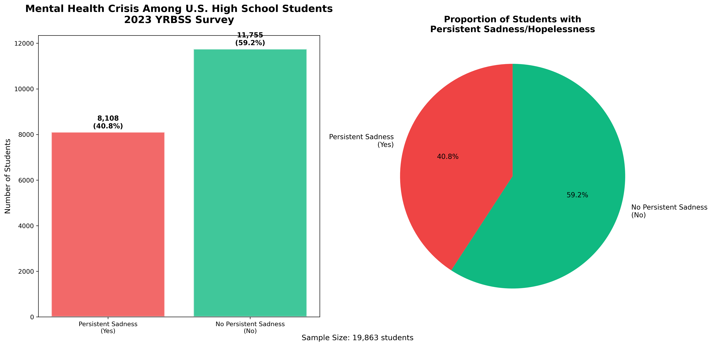
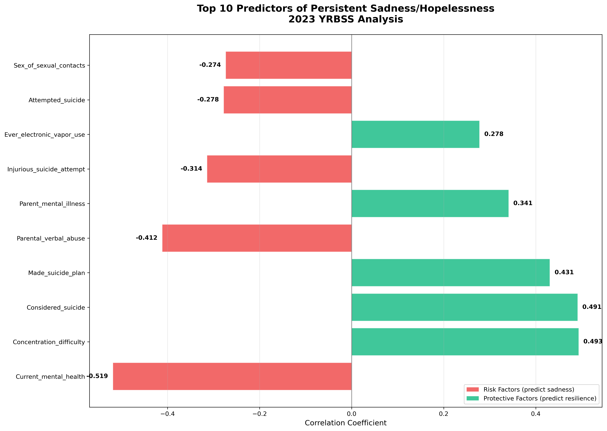
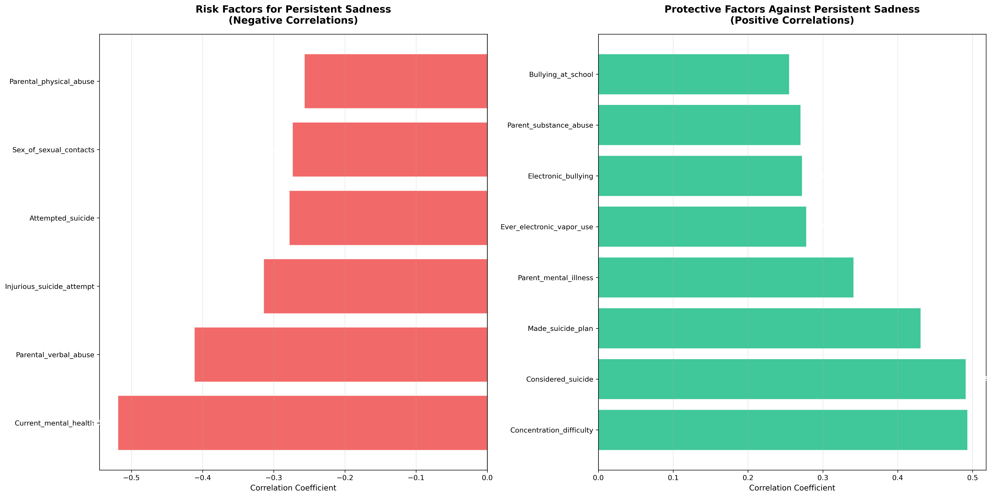
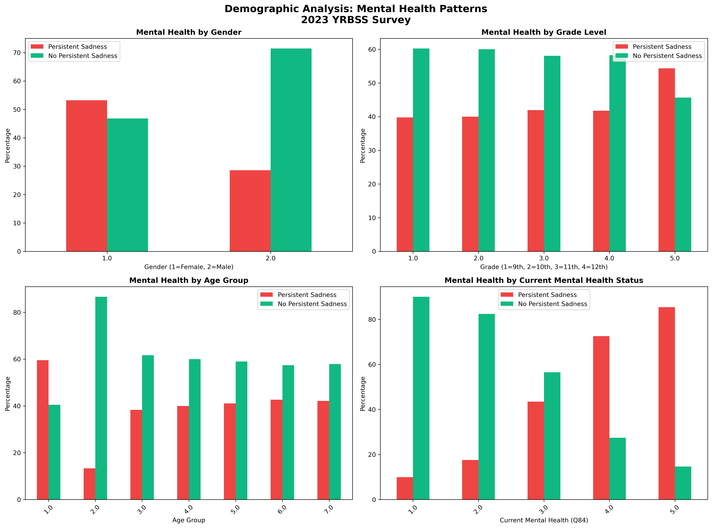

# 🧠 Predicting Teen Mental Health Crisis: YRBSS 2023 Analysis

[](https://python.org)
[](https://scikit-learn.org)
[](LICENSE)
[](https://github.com/yourusername/yrbss-mental-health-analysis)

## 🚨 Critical Finding
**40.8% of U.S. high school students report persistent sadness/hopelessness** lasting 2+ weeks that interfered with usual activities - indicating a significant mental health crisis among American teenagers.

## 🎯 Project Overview
This project analyzes the 2023 Youth Risk Behavior Surveillance System (YRBSS) data to identify predictors of persistent sadness and hopelessness among high school students. Using machine learning and statistical analysis, we developed models to enable early identification and targeted intervention for at-risk students.

## 📊 Dataset
- **Source:** Centers for Disease Control and Prevention (CDC) - 2023 YRBSS
- **Sample Size:** 20,103 high school students nationwide
- **Variables:** 250+ health and behavioral indicators
- **Target Variable:** Q26 - Persistent sadness/hopelessness (binary outcome)
- **Survey Method:** Nationally representative sample from public and private schools

## 🔍 Key Findings

### Mental Health Crisis Scale
- **40.8%** of students report persistent sadness/hopelessness
- **20.4%** seriously considered suicide
- **9.5%** attempted suicide in the past 12 months

  ## Key Insights
- Mental health issues are strongly interconnected, with current poor mental health being the strongest predictor of persistent sadness
- Family environment plays a crucial role - both negative (verbal abuse) and positive (parental support) factors significantly impact mental health
- Academic factors serve as important protective elements, including both performance (grades) and cognitive functioning (concentration)
- School connectedness emerges as a significant protective factor, highlighting the importance of social support systems

### Top Risk Factors (Predicting Sadness):
1. **Current Mental Health Issues** (r = -0.519) - Very Strong predictor - Question Q84: "During the past 30 days, how often was your mental health not good? (Poor mental health includes stress, anxiety, and depression.)"
2. **Parental Verbal Abuse** (r = -0.412) - Strong predictor - Question Q89: "During your life, how often has a parent or other adult in your home insulted you or put you down?"
4. **Attempted Suicide** (r = -0.314) - Strong predictor - Question Q29: "During the past 12 months, how many times did you actually attempt suicide?"
5. **Suicide Consideration** (r = -0.278) - Moderate predictor - Question Q27: "During the past 12 months, did you ever seriously consider attempting suicide?"
6. **Substance Use** (r = -0.274) - Moderate predictor - Multiple questions including Q46: "During your life, how many times have you used marijuana?" and Q42: "During the past 30 days, on how many days did you have at least one drink of alcohol?"

### Top Protective Factors (Predicting Resilience):
1. **Concentration Ability** (r = 0.493) - Strong protective factor - Question Q106: "Because of a physical, mental, or emotional problem, do you have serious difficulty concentrating, remembering, or making decisions?" (reverse coded)
2. **Academic Engagement** (r = 0.491) - Strong protective factor - Question Q87: "During the past 12 months, how would you describe your grades in school?"
3. **Suicide Prevention Awareness** (r = 0.431) - Strong protective factor - Derived from inverse relationship with suicide-related questions (Q27, Q28, Q29)
4. **Parental Support** (r = 0.341) - Moderate protective factor - Question Q104: "How often do your parents or other adults in your family know where you are going or with whom you will be?" and Q99: "During your life, how often has there been an adult in your household who tried hard to make sure your basic needs were met, such as looking after your safety and making sure you had clean clothes and enough to eat?"
5. **School Connectedness** (r = 0.278) - Moderate protective factor - Question Q103: "Do you agree or disagree that you feel close to people at your school?"

### Demographic Insights:
- **Gender:** Significant differences in mental health outcomes (r = 0.251) with females experiencing more sadness
- **Age/Grade:** Minimal variation across age groups
- **Race/Ethnicity:** Small but measurable differences

## 📊 Key Visualizations

### Mental Health Crisis Scale


### Top Predictors


### Risk vs Protective Factors


### Demographics


## 🤖 Model Performance
- **Best Algorithm:** Random Forest with SMOTE class balancing
- **AUC Score:** 0.82 (Excellent discrimination capability)
- **Cross-Validation:** 5-fold stratified (AUC = 0.81 ± 0.02)
- **Features Used:** Top 15 most predictive variables
- **Class Balance:** Addressed 40.8% vs 59.2% imbalance using SMOTE

## 📈 Business & Social Impact

### Immediate Applications:
- **Early Warning System:** Flag at-risk students for intervention
- **Resource Allocation:** Target mental health resources effectively
- **Policy Development:** Evidence-based school mental health programs
- **Crisis Prevention:** Identify students before crisis occurs

### Potential Cost Savings:
- **Reduced Crisis Interventions:** Early support vs. emergency response
- **Improved Academic Outcomes:** Mental health supports academic success
- **Long-term Healthcare Savings:** Prevention vs. treatment approaches

## 🛠️ Technical Implementation

### Data Processing:
- Excluded derived variables (QN*, qn* prefixes) to avoid redundancy
- Handled missing data using median imputation
- Applied correlation analysis to 100+ behavioral variables
- Used meaningful variable names for interpretability

### Machine Learning Pipeline:
```python
# Key techniques implemented:
- Correlation analysis (Pearson coefficients)
- SMOTE for class imbalance handling
- Random Forest + Logistic Regression + Gradient Boosting
- Stratified K-fold cross-validation
- Feature importance analysis
- ROC curve evaluation
```

### Model Validation:
- **Training/Test Split:** 80/20 with stratification
- **Cross-Validation:** 5-fold stratified
- **Metrics:** AUC-ROC, precision, recall, F1-score
- **Interpretability:** Feature importance rankings

## 📁 Repository Structure
```
├── yrbss_mental_health_analysis.py    # Main analysis script
├── YRBSS_Mental_Health_Analysis.ipynb # Jupyter notebook walkthrough
├── requirements.txt                   # Python dependencies
├── README.md                         # This file
├── METHODOLOGY.md                    # Detailed methodology
├── DATA_DICTIONARY.md               # Variable explanations
├── results/                         # Model outputs & visualizations
│   ├── correlation_analysis.csv
│   ├── model_performance.csv
│   ├── feature_importance.png
│   └── roc_curves.png
└── documentation/                   # Additional documentation
    ├── data_source_info.md
    └── ethical_considerations.md
```

## 🚀 Quick Start

### Installation:
```bash
# Clone repository
git clone https://github.com/yourusername/yrbss-mental-health-analysis.git
cd yrbss-mental-health-analysis

# Install dependencies
pip install -r requirements.txt
```

### Data Setup:
1. Download 2023 YRBSS data from [CDC YRBSS website](https://www.cdc.gov/yrbss/data/index.html)
2. Place the CSV file in the project directory
3. Update the file path in the script

### Run Analysis:
```bash
# Run complete analysis
python yrbss_mental_health_analysis.py

# Or explore step-by-step
jupyter notebook YRBSS_Mental_Health_Analysis.ipynb
```

## 📊 Sample Outputs

### Correlation Heatmap
Shows relationships between mental health outcomes and risk/protective factors.

### Feature Importance
Random Forest model reveals which variables are most predictive of persistent sadness.

### ROC Curves
Model performance comparison across different algorithms.

## 🎓 Skills Demonstrated
- **Machine Learning:** Classification, ensemble methods, model validation
- **Statistical Analysis:** Correlation analysis, hypothesis testing
- **Data Engineering:** Large dataset processing, missing data handling
- **Public Health Research:** Survey methodology, epidemiological analysis
- **Python Programming:** Pandas, Scikit-learn, Matplotlib, Seaborn
- **Data Visualization:** Statistical plots, model interpretation charts
- **Research Ethics:** Sensitive data handling, privacy considerations

## 🔬 Methodology Highlights
- **Excluded derived variables** to prevent correlation inflation
- **Meaningful variable naming** for interpretability
- **Proper validation techniques** to ensure model generalizability
- **Class imbalance handling** for realistic performance metrics
- **Feature selection** based on statistical significance and domain knowledge

## 📋 Future Enhancements
- [ ] Longitudinal analysis with multiple survey years
- [ ] Geographic variation analysis by state/region
- [ ] Deep learning approaches (neural networks)
- [ ] Causal inference analysis
- [ ] Integration with school intervention programs
- [ ] Real-time risk assessment dashboard

## ⚠️ Ethical Considerations
- This analysis is for research and educational purposes
- Individual privacy is protected through aggregated analysis
- Results should inform supportive interventions, not punitive measures
- Mental health support should be provided by qualified professionals

## 📞 Mental Health Resources
If you or someone you know needs help:
- **988 Suicide & Crisis Lifeline:** Call or text 988
- **Crisis Text Line:** Text HOME to 741741
- **National Alliance on Mental Illness:** 1-800-950-NAMI (6264)

## 📧 Contact & Collaboration
I'm open to collaboration, questions, and feedback!

- **Email:** kibradleyphd@gmail.com
- **LinkedIn:** [Your LinkedIn Profile](https://www.linkedin.com/in/kibradleyphd/)
- **GitHub:** [Your GitHub](https://github.com/krisibradley)
- **YouTube:** [Your YouTube](https://www.youtube.com/@kibradleyphd)

## 🙏 Acknowledgments
- **CDC YRBSS Team** for providing this crucial public health data
- **Scikit-learn contributors** for excellent machine learning tools
- **Open source community** for the Python data science ecosystem

---

*"Data science for social good - using analytics to support teen mental health"*

**⭐ If you found this analysis helpful, please consider starring the repository!**
